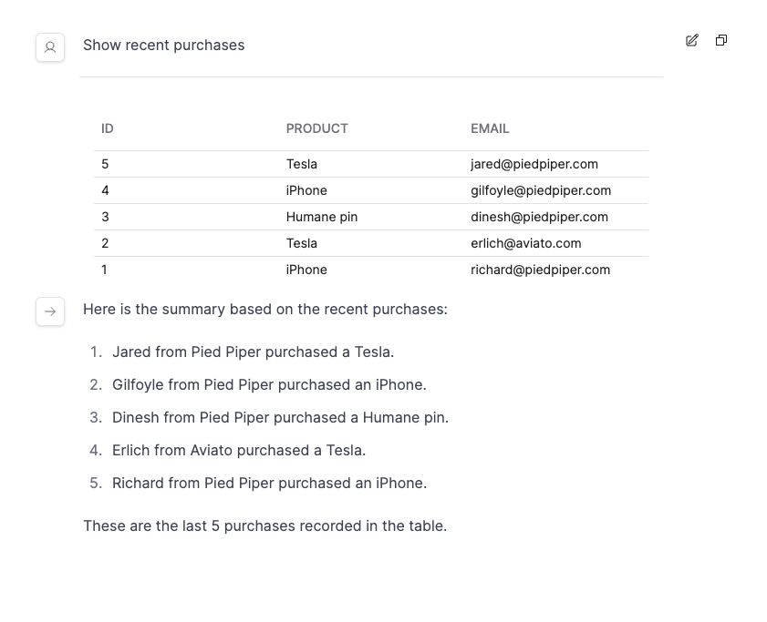

# OpenAssistants

OpenAssistants is a collection of open source libraries aimed at developing robust AI assistants rather than autonomous agents. By focusing on specific tasks and incorporating human oversight, OpenAssistants strives to minimize error rates typically found in agentic systems.

- `openassistants` the core library responsible for the main function calling / message generating runtime
- `openassistants-fastapi` a set of FastAPI routes used for interacting with the core runtime loop through a REST API
- `openassistants-ui` an example chat client that supports rich streaming outputs like tables, plots, form inputs and text.

It's built on LangChain and designed to be an open alternative to OpenAI's AssistantsAPI.

Join us in creating AI assistants that are not only useful but dependable for production use today.

## Features
- Included Chat UI
- Support function calling with any LLM (open source & proprietary)
- Declarative library of functions
- Built-in SQL functions (DuckDB support)
- Extend with any custom Python function
- Support for 50+ functions in a single chat Assistant
- Native OpenAI Functions integration

 

 
  <i>OpenAssistants UI</i>

## Quick Start

To run the project locally:

- Navigate to `example/fast-api-server`:
  - Run `poetry install`
  - Activate the virtual environment with `poetry shell`
  - Start the server with `./run.sh`

- Then, go to `example/next`:
  - Install dependencies with `yarn install`
  - Launch the development server with `yarn run dev`
  - Access the application at `localhost:3000`

Join our community and start contributing today!
